# icinbank
Online-Bank-Simulator

Spring Boot/Spring Data/Spring Security/Hibernate/MySQL/REST

The project simulates online banking system. It allows to register/login, deposit/withdraw money from accounts, add/edit recipients, transfer money between accounts and recipients, view transactions, make cheque book request.

There are two roles user and admin (devadeepdeb as user, gkdeb as admin).

<h3>Deployment Steps on Docker via Jenkins</h3>

I have used my personal laptop Jenkins and Docker application to run it.

Deployment steps are available in <a href="https://github.com/devadeepdeb/icinbank/blob/master/Jenkinsfile">Jenkinsfile</a>

Also used automated selenium and junit5 tests in <a href="https://github.com/devadeepdeb/icinbank/blob/master/Jenkinsfile">Jenkinsfile</a> to create both admin and user mentioned above in chrome browser only.

Issued command "java -jar jenkins.war" where jenkins.war is installed to launch jenkins

It opened on port 8080. Installed docker plugins from Maven and created a multipipeline project named "BankPipeline"

Configured it as below.

Click on create branch which generated master branch for  "BankPipeline". Go to that branch and click "Build Now".

Multi staged pipeline completed like this with logs.

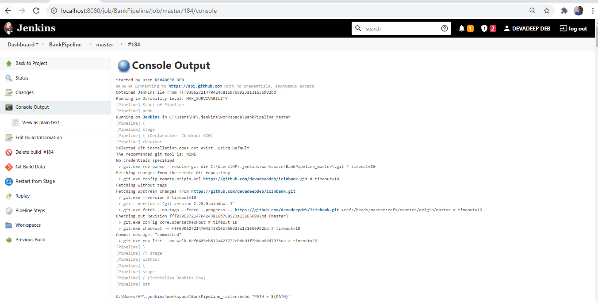
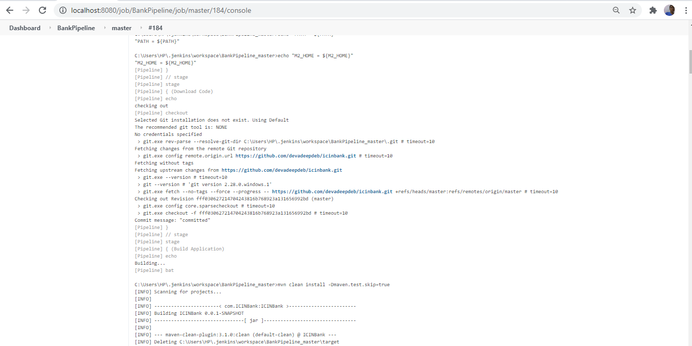

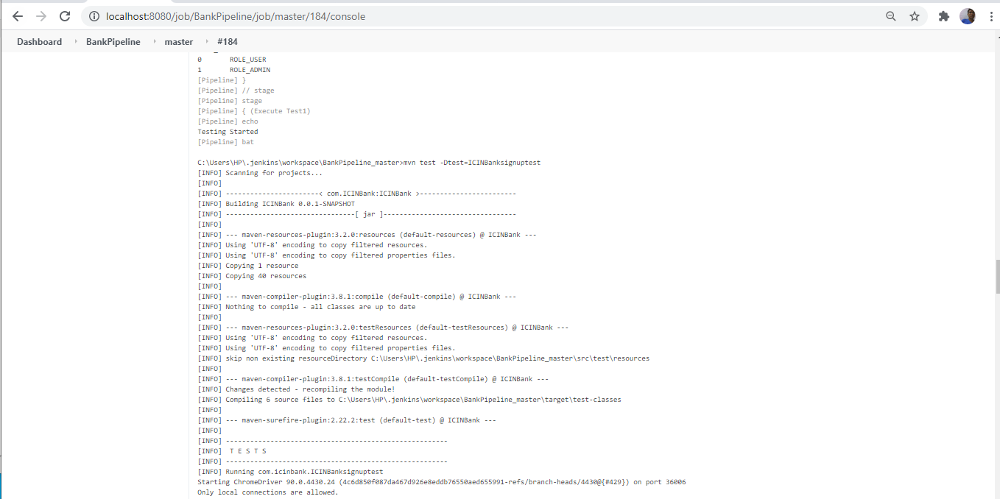
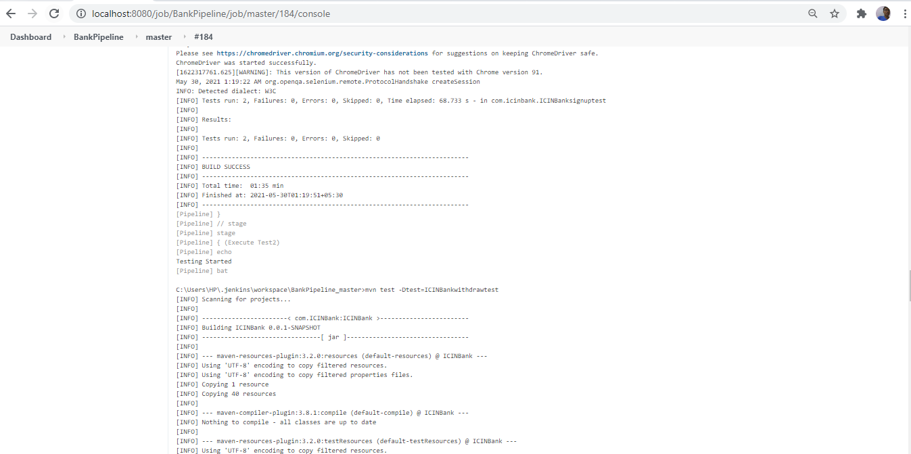

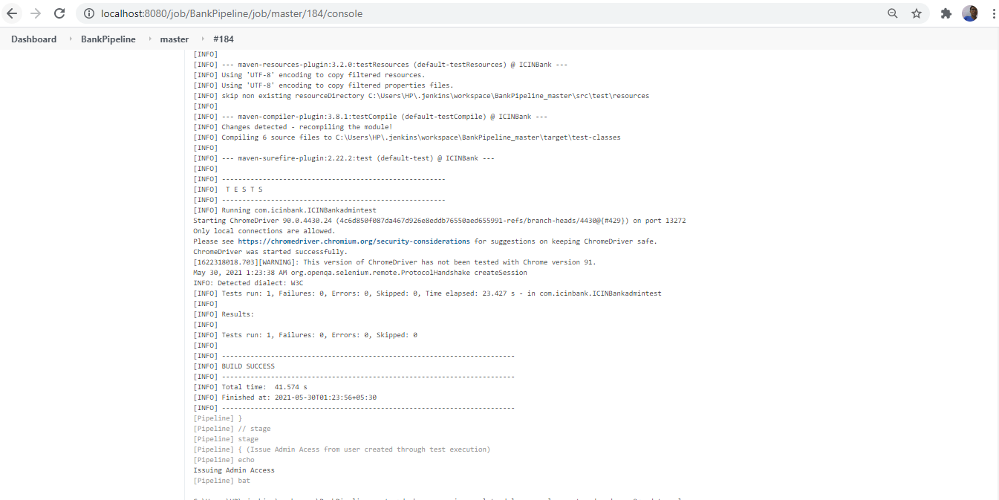
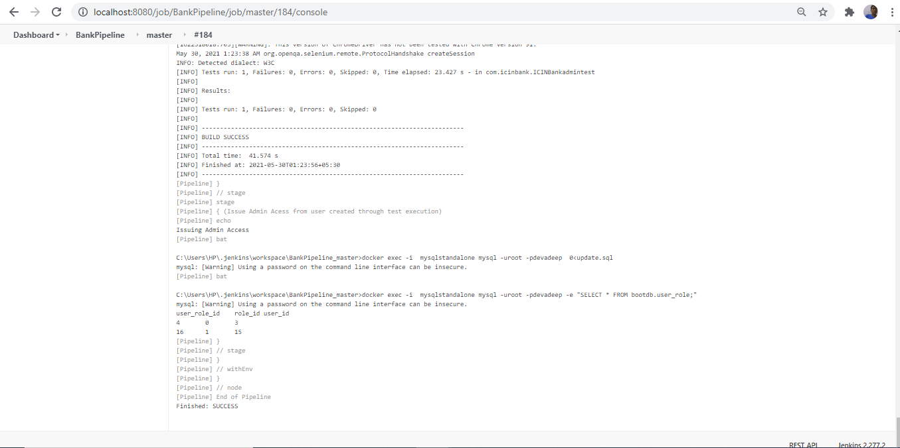

After that Spring boot application start on port 7070 as per below screenshots

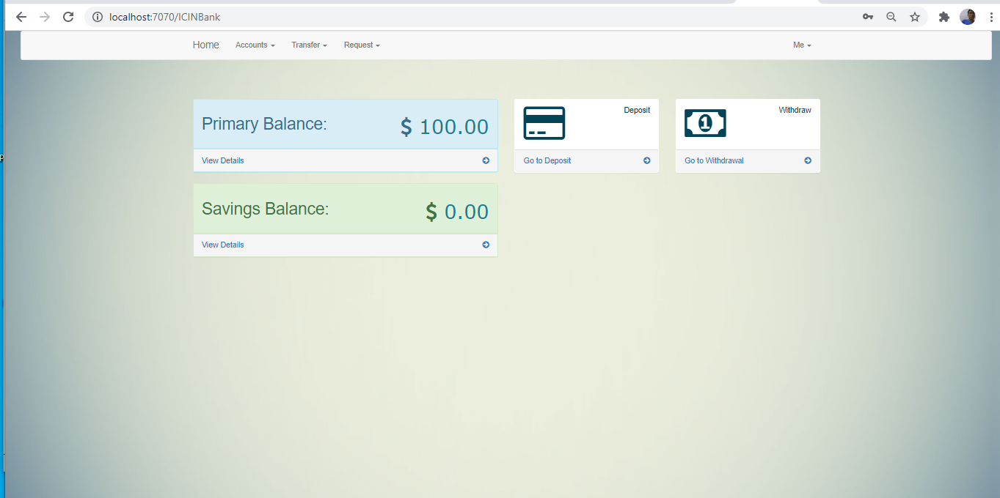

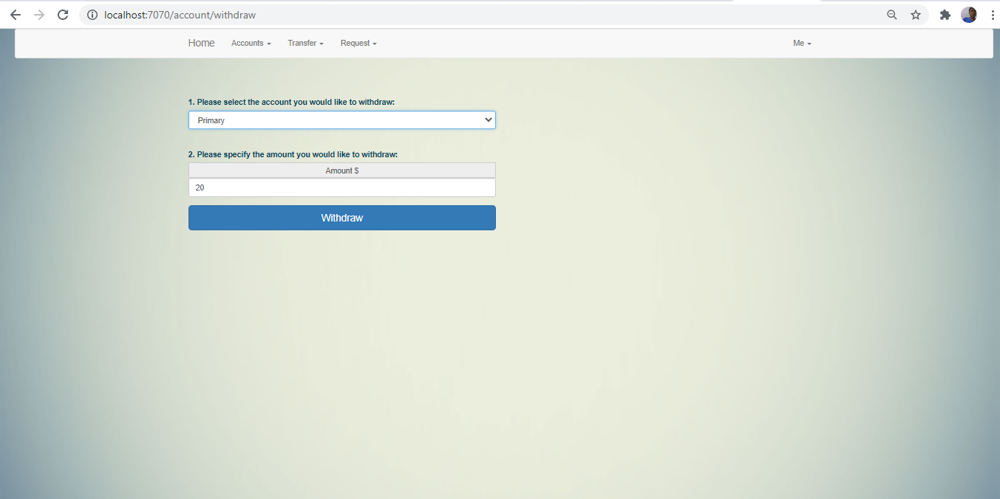
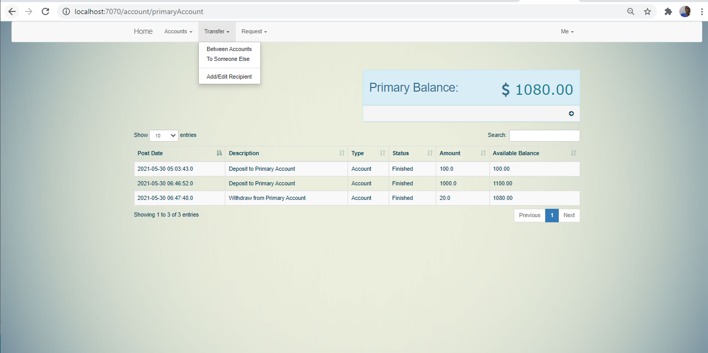
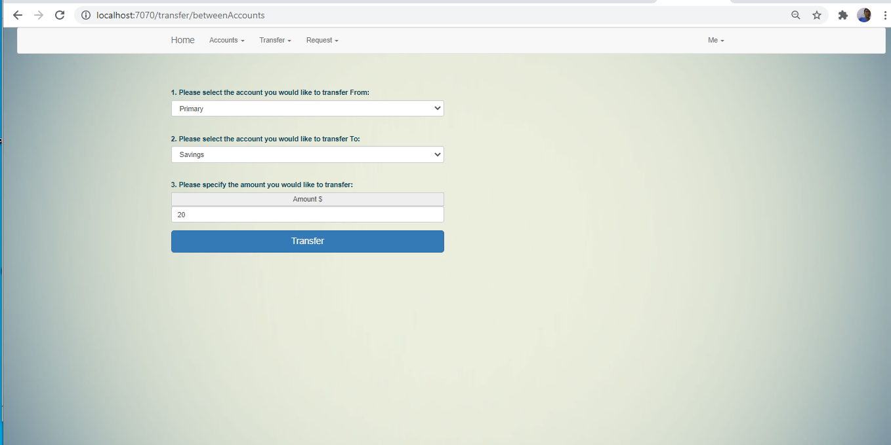

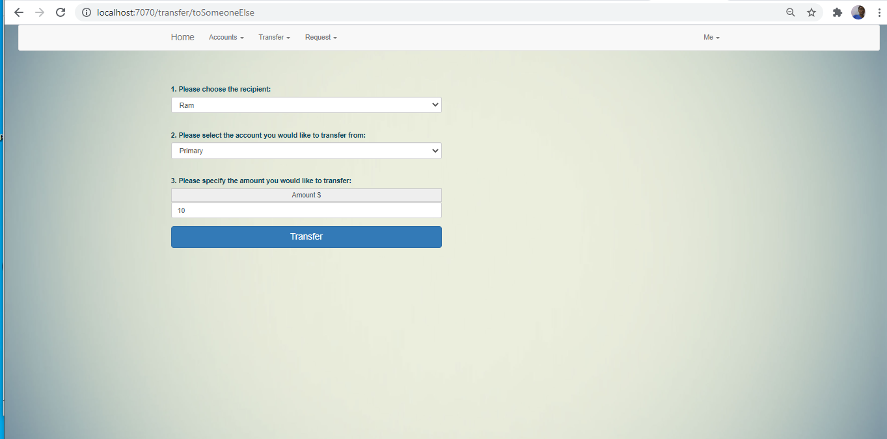
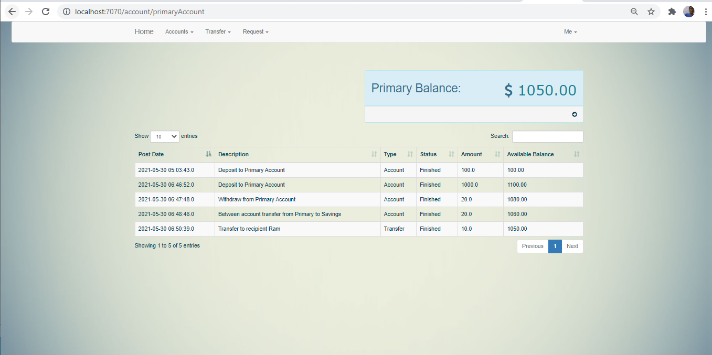
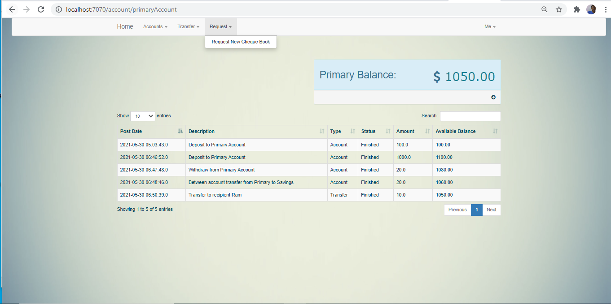

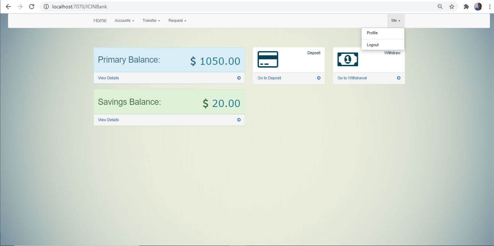

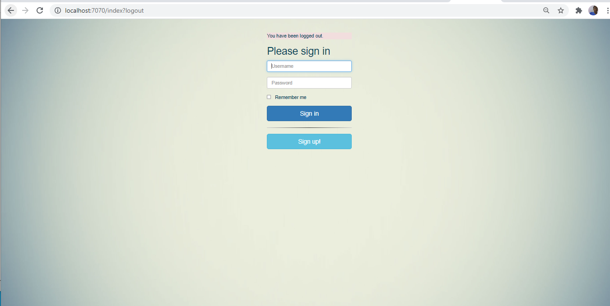

Below is the way how the admin can be updated manually via mysql:8.0.23 docker running container

<h3>Deployment Steps on AWS EC2 instance</h3>
<pre>
1)  I used https://github.com/devadeepdeb/icinbank
2)	I went to AWS Web Console https://us-east-1.console.aws.amazon.com/console/home?region=us-east-1# and selected EC2 in Services
3)	Then I created instance by clicking on “EC2 Dashboard” and then “Launch Instance”.
4)	I chose “Amazon Linux 2 AMI (HVM), SSD Volume Type” and “t2 micro type” and proceeded with default settings of “Configure Instance”, “Add Storage”, “Add Tags”.
5)	In “Configure Security Group” I clicked on “Add Rule” to add Type “All traffic” and Source “Anywhere” to be visisble to everyone without any access restriction.
6)	Then clicked on “Review and Launch” to launch instance . The instance will come in “Running State”
7)	Click on “Instances” to see the running Instance ID and note down the Public Ipv4 for my running instance.
8)	Select the Instance and click on “Connect” to open https://console.aws.amazon.com/ec2/v2/connect/ec2-user/yourinstance (EC2 SSH instance or machine)
9)	Install maven (yum update –y,  yum install docker –y), git (yum install git –y), docker (yum install docker  –y), jenkins (yum install jenkins  –y), on EC2 SSH instance and check versions of git (git –version), docker (docker –version), maven (mvn –v) to confirm.
10)	SSH as root user in EC2 SSH instance i.e “sudo –i”
11)	Write command git clone git://github.com/devadeepdeb/icinbank.git in EC2 SSH instance
12)	Start docker in EC2 SSH instance (systemctl start docker)
13)	Create Jenkins job to Fetch changes from the remote Git repository https://github.com/devadeepdeb/icinbank
14)	Cd to path where git repository was cloned
15)	Write “docker build -t usermysql .” to create docker  image on above cloned repo
16)	Write “docker run -d -p 5001:8080 devadeepdebcustomimage” to create docker image on above cloned repo
17)	Write "docker pull mysql:8.0.23" to pull mysql 8.0.23 version image on above repo
18)	Write “docker run --name mysqlstandalone -e MYSQL_DATABASE=bootdb -e MYSQL_ROOT_PASSWORD=devadeep -e MYSQL_ROOT_USER=root -d mysql:8.0.23" to run mysql container
19)	Write "docker run -d -p 7070:8080 --name usermysql --link mysqlstandalone:mysql usermysql" to run application container
20)	Now open http://3.94.213.17:7070/ to host Springboot application docker container on AWS EC2 instance for end users.
21)	Loaded application screenshot is as below (I have only deployed in AWS EC2 instance. We also need to configure mysql db table updates for admin user , which is only performed via Jenkins. I have not used Jenkins in AWS deployment)
</pre>

Admin will control the user application via Angular whose github url is <a href="https://github.com/devadeepdeb/AdminPortal">Admin Angular</a> to enable or disable user and approval of cheque requests.
